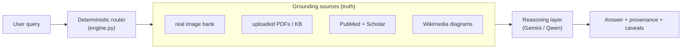
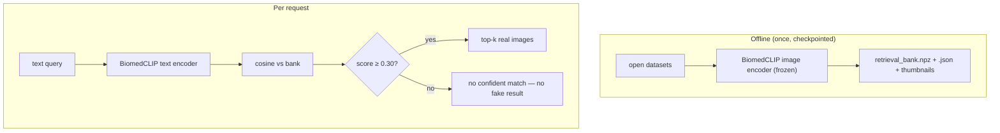
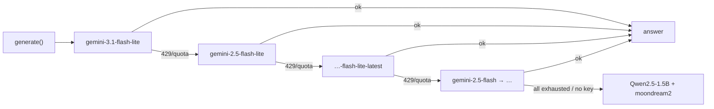

# 🛡️ MultiMedAI — Project Defense

**Design rationale, trade-offs, honest limitations, and anticipated questions.**

Companion to the [README](README.md). Read this to understand *why* the system is built the
way it is — not just *what* it does.

---

## Table of contents

1. [Problem & motivation](#1-problem--motivation)
2. [Goals and hard constraints](#2-goals-and-hard-constraints)
3. [Why this architecture](#3-why-this-architecture)
4. [Design decisions & the alternatives rejected](#4-design-decisions--the-alternatives-rejected)
5. [The retrieval backbone (the heart of the system)](#5-the-retrieval-backbone-the-heart-of-the-system)
6. [Reasoning layer: Gemini + graceful local fallback](#6-reasoning-layer-gemini--graceful-local-fallback)
7. [Document RAG](#7-document-rag)
8. [Live literature (PubMed + Scholar)](#8-live-literature-pubmed--scholar)
9. [Labelled diagrams: why retrieval, not diffusion](#9-labelled-diagrams-why-retrieval-not-diffusion)
10. [Context-awareness & follow-ups](#10-context-awareness--follow-ups)
11. [Safety, ethics & restricted content](#11-safety-ethics--restricted-content)
12. [Honest metrics & how they were measured](#12-honest-metrics--how-they-were-measured)
13. [Limitations & threats to validity](#13-limitations--threats-to-validity)
14. [Anticipated defense questions (Q&A)](#14-anticipated-defense-questions-qa)
15. [Future work](#15-future-work)

---

## 1. Problem & motivation

Medical AI demos usually assume a GPU, paid APIs, and closed data — and they often **hallucinate
confident-sounding answers**. The goal here was the opposite: a **genuinely runnable**, honest,
multimodal assistant for **medical education and research** that a student or clinician can run on
an ordinary laptop, that grounds everything it says, and that **refuses to fake numbers or findings**.

## 2. Goals and hard constraints

| Constraint | Consequence in the design |
|---|---|
| **CPU-only** (AMD/Windows, no usable torch GPU) | Frozen encoders, precomputed embeddings, distilled diffusion (SD-Turbo), small local LLM. |
| **Zero paid/cloud cost** for the core | Local models are the baseline; free-tier Gemini + free SerpApi are *optional* accelerators with fallback. |
| **Open models & data only** | Every dataset/model is openly licensed (MIT/Apache/BSD/open HF). |
| **Never fabricate metrics or findings** | Confidence floors, "indicative" labels, honest small-sample numbers, no invented VQA accuracy. |

These constraints are not incidental — they shaped **every** component choice below.

## 3. Why this architecture

The philosophy is **"router + grounding + thin reasoning"**, not "one big generative model".
A deterministic router picks the right grounding source; the LLM only **rephrases grounded
inputs**. This is feasible on CPU and it is *auditable* — you can point at where every claim came
from.

## 4. Design decisions & the alternatives rejected

| Decision | Alternatives considered | Why chosen |
|---|---|---|
| **BiomedCLIP frozen** for retrieval | QuiltNet B/16 & B/32; fine-tuning CLIP | Highest concept Hit@10 (65% vs 52.5%); fine-tuning needs a GPU and risks over-fitting a small set. |
| **Deterministic intent router** | Let an LLM decide everything | Predictable, debuggable, no quota spent to classify intent, works offline. |
| **SD-Turbo, inference only** | SD 1.5 (20–25 steps), training a LoRA on CPU | ~8 CPU steps for a usable image; training diffusion on CPU is infeasible. |
| **Gemini free tier as optional** | OpenAI/Claude (no free API), local-only | Free, fast, multimodal; **kept optional** with a local fallback so the core stays zero-cost. |
| **Wikimedia for labelled diagrams** | Generate labels with diffusion; draw labels ourselves | Diffusion cannot render legible anatomical text; real diagrams are accurate and openly licensed. |
| **Qwen2.5-1.5B** local LLM | FLAN-T5 (explicitly rejected by stakeholder), Phi-2, Mistral-7B | Modern, Apache-2.0, CPU-runnable in ~10–20 s; 7B too slow on CPU. |
| **SQLite + NumPy stores** | A vector DB (FAISS/Chroma) service | No server to run, trivial to ship, fast enough at ~80k vectors on CPU. |

## 5. The retrieval backbone (the heart of the system)

- **Why frozen:** aligning to a medical text/image space is exactly what BiomedCLIP already does;
  freezing keeps it CPU-viable and avoids over-fitting.
- **Why a confidence floor:** the single most important anti-hallucination guard on the image side.
  Real top matches score ~0.40–0.45; a 0.30 floor turns "here's a vaguely similar image" into an
  honest "no confident match."
- **Why additive/checkpointed ingestion:** an ~80k bank can't be embedded in one CPU pass; the
  builder resumes and appends per source (pathology → radiology → chest → derm → brain → bone → hair).

## 6. Reasoning layer: Gemini + graceful local fallback

Gemini gives fast, context-aware, multimodal answers — but the free tier has **per-model quota**.
So `cloudllm.py` implements a **fallback chain** that rotates to the next model on any 429/quota
error, and if no key is present the whole system falls back to **Qwen2.5-1.5B + moondream2** locally.

Why `flash-lite`: the `2.5-flash` "thinking" variant spends its token budget on hidden reasoning and
**truncates** the visible answer; the lite variants return complete answers and have freer quota.

**Cost discipline:** an image analysis is **one** Gemini call (vision + explanation combined) and a
report follow-up is **one** call — verified by instrumenting the generator with a counter. Local
grounding (modality/finding checks, neighbours) uses the **free** BiomedCLIP models, so quota is spent
only where it adds value.

## 7. Document RAG

Uploaded PDFs are chunked, embedded with **MiniLM**, and stored in **SQLite**. Questions retrieve the
top chunks; reports retrieve on an "objective/methods/results/conclusions" query and are rendered to a
**page-cited, downloadable PDF**. This keeps document answers grounded in the user's own source.

## 8. Live literature (PubMed + Scholar)

`research.py` is **medical-topic gated** (`is_medical`) so it doesn't waste the SerpApi free quota
(250/month) on off-topic queries. Results always **mix ~half Google Scholar + half PubMed**, support a
**requested count (1–50)** and **year filtering**, and Scholar results are cached in SQLite to conserve
quota. PubMed E-utilities are free and used freely.

## 9. Labelled diagrams: why retrieval, not diffusion

Diffusion models produce **gibberish text**, so a "labelled diagram" cannot be *generated*. Instead
`atlas.py` fetches **real, openly-licensed diagrams from Wikimedia Commons** and ranks them to prefer:
**human + English + actually-labelled + on-topic**, penalising photos, non-human species, unlabelled
images, multilingual/foreign-language variants, and off-topic plates. The single best match is shown
as one large image with a source link. SD-Turbo is reserved for **non-labelled** illustrative generation.

## 10. Context-awareness & follow-ups

A subtle but important fix: a follow-up like *"elaborate on the risk factors you mentioned above"* must
**stay on the previous topic**. Early on, such follow-ups ran a fresh KB search and drifted to unrelated
passages. Now the router **distinguishes**:

- **Regenerate** ("summarize / make a report of the above") → a same-topic structured report + PDF.
- **Contextual question** ("elaborate on X you mentioned") → answered **grounded in the previous answer**,
  no fresh KB search, so it can't drift.
- A PDF is produced **only** on an explicit create-a-report phrase — not merely because the word
  "report" appears in a question.

## 11. Safety, ethics & restricted content

- **Two-layer restricted-content filter:** a **word-boundary** caption regex (so "kidney" isn't caught by
  "kid", "analysis" isn't caught by "anal") **plus** an NSFW **image classifier**.
- **Request-based access** for restricted material (explicit/intimate, or minors < 18): the requester must
  give a clinical reason, a medical role, and proof (institution + registration ID or a credential file);
  every request is **audit-logged**. In-app grants are provisional/self-attested — real verification is manual.
- **No personal diagnosis/treatment advice** (safety boundary), and an *"educational, not a diagnosis"*
  note on every answer.

## 12. Honest metrics & how they were measured

| Metric | Value | How measured |
|---|---|---|
| Retrieval concept Hit@10 | **65.0%** | 500 held-out unique images; concept-relevance of top-10 vs query term. Benchmarked against QuiltNet (52.5% / 37.5%). |
| Chest-disease accuracy | **~94%** | TB/COVID/Pneumonia/Normal probe on the streamed chest subset. |
| VQA (frozen probe) | **~55%** | Linear head on frozen BiomedCLIP over PathVQA closed vocab — reported as the **honest ceiling** of a frozen probe. |
| Synthesis FID | **~511** | 8 real vs 8 generated histopathology images — **high variance on tiny sets**, reported transparently. |

No number here is rounded up for effect. Where a method is weak (VQA, FID), it is stated plainly and a
GPU fine-tuning path is documented rather than faked.

## 13. Limitations & threats to validity

- **VQA is a frozen-probe ceiling (~55%)** — real open-ended VQA needs the BLIP-VQA fine-tune (Colab notebook).
- **FID is high and high-variance** — synthesis is a *demo*, always marked synthetic; it is not a clinical generator.
- **Localization is indicative** — Gemini boxes / Grad-CAM are **not** validated detectors; the UI says so.
- **Zero-shot modality guesses** are hidden below a confidence threshold to avoid misleading labels.
- **Gemini free tier** has quota limits — mitigated by the fallback chain and local fallback, but heavy use
  can still exhaust it.
- **Not a medical device** — outputs must be clinician-verified; nothing here is a diagnosis.

## 14. Anticipated defense questions (Q&A)

> **Q: Isn't this just a wrapper around Gemini?**
> No. The core (retrieval over an 80k medical-image bank, document RAG, literature search, labelled-diagram
> retrieval, safety) runs **without any cloud model**. Gemini is an *optional* accelerator with a full local
> fallback (Qwen + moondream). The grounding sources, not the LLM, are the substance.

> **Q: How do you stop it from hallucinating?**
> Retrieval uses a **cosine confidence floor** (no confident match → say so). Answers are **grounded** in a
> retrieved image, an uploaded document, retrieved literature, or a labelled reference. The LLM is instructed
> to rephrase grounded inputs, not invent. Localization and synthesis are explicitly labelled "indicative/synthetic".

> **Q: Why frozen BiomedCLIP instead of fine-tuning?**
> CPU-only + small data. Fine-tuning risks over-fitting and needs a GPU; BiomedCLIP already gives the best
> concept Hit@10 in our benchmark. We fine-tune only the tiny VQA head, and even then report the honest ceiling.

> **Q: Why is VQA only ~55%?**
> Because it's a **linear probe on a frozen encoder** with a closed vocabulary — that's its honest ceiling.
> We deliberately didn't fabricate a higher number; the BLIP-VQA GPU notebook is the path to 60–80%.

> **Q: Why retrieve diagrams instead of generating labelled ones?**
> Diffusion models can't render legible text, so a "generated labelled diagram" would be gibberish. Real
> Wikimedia diagrams are accurate and openly licensed; we rank for human + English + labelled + on-topic.

> **Q: How is patient/ethical safety handled?**
> Restricted content (explicit / minors) is filtered by caption regex + NSFW classifier and gated behind an
> **audit-logged, proof-of-credentials request**. Personal diagnosis requests are refused. Every answer is
> marked educational.

> **Q: Why not FAISS / a vector DB?**
> At ~80k vectors on CPU, a NumPy cosine over a memory-mapped matrix is fast enough and ships with **zero
> extra services** — matching the "runs on a laptop" goal.

> **Q: What happens when the Gemini quota runs out mid-session?**
> The fallback chain rotates to the next Gemini model automatically (each has its own quota bucket); if all
> are exhausted or no key exists, it falls back to the local Qwen/moondream models. The app never hard-fails.

> **Q: How do you keep API keys safe?**
> Keys live only in a **gitignored** `.keys.json` (or the `GOOGLE_API_KEY` env var). They are never committed;
> `.gitignore` and a pre-push check enforce this.

## 15. Future work

- BLIP-VQA fine-tuning (Colab GPU) → real open-ended VQA 60–80%.
- Per-field re-weighting / expansion of the image bank.
- Streaming report generation to cut perceived latency.
- A verified (non-self-attested) restricted-access workflow with real credential checks.
- Optional GPU path (the Colab notebooks already exist for SD-LoRA / SDXL-FLUX / BLIP-VQA).

---

**MultiMedAI is an educational/research system — indicative only, never a diagnosis.**

