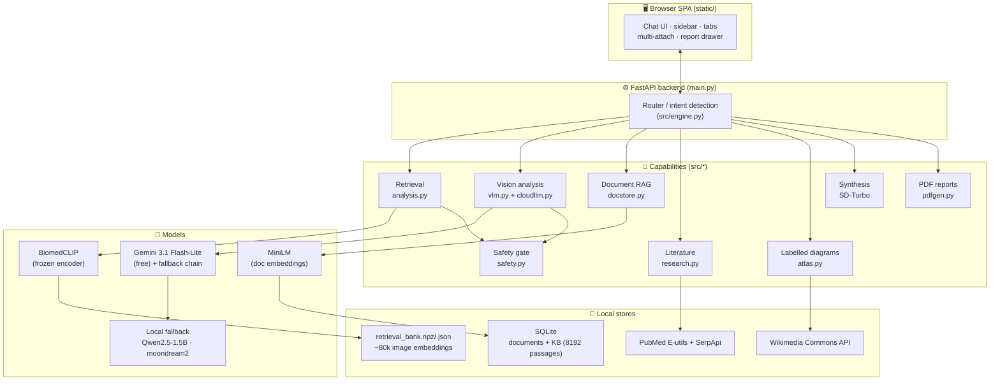
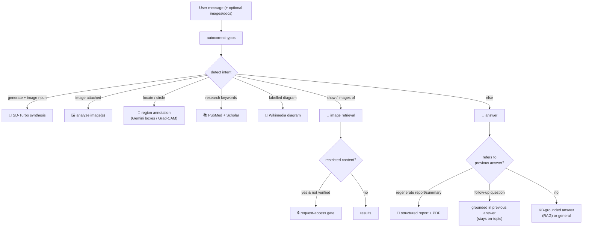

<div align="center">

# 🩺 MultiMedAI

**A local, zero-cost, CPU-only multimodal medical AI assistant for education & research.**

Search real medical images · analyze uploaded scans · study documents (RAG) ·
find live literature · retrieve labelled anatomy diagrams — all from one chat UI.

`FastAPI` · `BiomedCLIP` · `Gemini (free tier) + local fallback` · `SD-Turbo` ·
`PubMed + Google Scholar` · `SQLite RAG`

> ⚠️ **Educational / research use only. Not a medical device, not a diagnosis, not treatment advice.**

</div>

---

## Table of contents

- [What it does](#what-it-does)
- [Screenshots](#screenshots)
- [Architecture](#architecture)
- [How a message is routed](#how-a-message-is-routed)
- [Models & why](#models--why)
- [Data & the image bank](#data--the-image-bank)
- [Honest metrics](#honest-metrics)
- [Safety & ethics](#safety--ethics)
- [Setup & run](#setup--run)
- [Usage examples](#usage-examples)
- [Project layout](#project-layout)
- [Constraints & design philosophy](#constraints--design-philosophy)
- [Roadmap](#roadmap)
- [Disclaimer](#disclaimer)

---

## What it does

MultiMedAI is a **retrieval-and-reasoning assistant**, not a black-box "medical oracle".
Everything it says is grounded in a real image, a real document, retrieved literature, or a
labelled reference — and it is built to **never fabricate metrics or invent findings**.

| Capability | What happens |
|---|---|
| 🔎 **Image search** | Text query → BiomedCLIP embedding → cosine search over an ~80k real medical-image bank → top matches (never a fake image). |
| 🖼️ **Image analysis** | Upload one or many scans → vision model reads **content & likely disease** (not imaging physics) + grounding from a trained classifier and neighbour cases. |
| 📄 **Document RAG** | Upload a PDF → chunk + embed (MiniLM) into SQLite → ask questions or **generate a page-cited report** (downloadable PDF). |
| 📚 **Live literature** | "research papers on X" → **PubMed + Google Scholar** mixed results, with year filtering and a requested count (1–50). |
| 🧠 **Labelled diagrams** | "labelled diagram of the brain" → a real, openly-licensed **Wikimedia Commons** diagram (diffusion can't render legible labels). |
| 🎨 **Synthesis** | Non-labelled illustrative image generation via **SD-Turbo** (clearly marked synthetic). |
| 📝 **Reports** | Structured, downloadable **PDF reports** from an image analysis, a document, or a topic. |
| 💬 **Context-aware follow-ups** | "elaborate on the risk factors you mentioned above" stays on-topic, grounded in the previous answer. |

---

## Screenshots

> Add your captures to [`docs/screenshots/`](docs/screenshots/) (filenames listed there).
> The architecture diagrams below are Mermaid and render on GitHub without any image files.

| Full UI | Multi-image analysis |
|---|---|
|  |  |

| Report + PDF | Live research |
|---|---|
|  |  |

| Labelled diagram | Restricted-access gate |
|---|---|
|  |  |

---

## Architecture



**Key idea:** the encoders are **frozen** and everything heavy is **precomputed** so the
whole thing runs on a **CPU-only Windows/AMD machine at zero cloud cost** (Gemini's free
tier and SerpApi's free plan are optional accelerators, with local models as fallback).

---

## How a message is routed



Routing lives in [`src/engine.py`](src/engine.py) (`detect_intent`) and the branch
handlers in [`main.py`](main.py).

---

## Models & why

| Role | Model | License | Why this one |
|---|---|---|---|
| **Retrieval / grounding encoder** | `microsoft/BiomedCLIP-PubMedBERT_256-vit_base_patch16_224` (ViT-B/16) | MIT | Best concept Hit@10 in our benchmark (**65%** vs QuiltNet 52.5%) — its PubMedBERT text tower matches clinical query terms. Kept **frozen**. |
| **Fast reasoning + vision** | **Gemini 3.1 Flash-Lite** (free tier) with a fallback chain | — | Near-instant vs slow CPU models; complete answers. Auto-rotates through other Gemini models on quota/429 errors. Optional — app works without it. |
| **Local text fallback** | `Qwen/Qwen2.5-1.5B-Instruct` | Apache-2.0 | Modern, efficient decoder LLM; runs on CPU in ~10–20 s. |
| **Local vision fallback** | `moondream2` | — | Compact VLM for image narration when no Gemini key. |
| **Document embeddings** | `all-MiniLM-L6-v2` | Apache-2.0 | Small, strong sentence embeddings for PDF-chunk RAG. |
| **Synthesis** | `stabilityai/sd-turbo` | — | Distilled SD → a good image in ~8 CPU steps. **Only for non-labelled** generation. |
| **Captioning (baseline)** | `Salesforce/blip-image-captioning-base` | BSD | CPU-fast captioner; real BLEU/ROUGE reported. |
| **NSFW classifier (safety)** | `Falconsai/nsfw_image_detection` | — | Image-side check for the restricted-content gate. |

Gemini is accessed via `google-generativeai`; the key lives in a **gitignored** `.keys.json`
or the `GOOGLE_API_KEY` env var — **never committed**.

---

## Data & the image bank

The retrieval bank is a NumPy matrix of BiomedCLIP embeddings (`weights/retrieval_bank.npz`)
with JSON metadata and 224px thumbnails, built additively (checkpointed) across open datasets:

| Field | Source | License note |
|---|---|---|
| Pathology | `flaviagiammarino/path-vqa` | open |
| Radiology (all-organ: chest/CT/MRI/brain/abdomen…) | `eltorio/ROCOv2-radiology` (~60k) | open |
| Chest disease (TB / COVID / Pneumonia) | `DevVoyageR007/...chest_Xray_images` | open |
| Dermatology | `marmal88/skin_cancer` | open |
| Brain MRI | `Falah/Alzheimer_MRI` | open |
| Bone / skeletal | `Hemg/bone-fracture-detection` | open |
| Hair / scalp | open HF dataset | open |

**≈ 80,761 images** total. Text→image search is plain cosine similarity with a
**confidence floor** (`min_score = 0.30`): below it the app says *"no confident match"*
rather than showing misleading results.

Document KB: **8,192 PubMed passages** (`pubmed_qa/pqa_artificial`) embedded with MiniLM in SQLite.

---

## Honest metrics

> Measured on small, CPU-sized subsets and **reported as-is** — a core project rule is to
> never inflate or fabricate numbers.

| Metric | Value | Notes |
|---|---|---|
| Retrieval concept **Hit@10** | **65.0%** | BiomedCLIP B/16, 500 held-out images (beat QuiltNet). |
| Chest-disease classifier accuracy | **~94%** | TB / COVID / Pneumonia / Normal probe. |
| VQA (frozen-probe head) | **~55%** | Honest ceiling of a frozen encoder + linear head; a BLIP-VQA fine-tune notebook targets 60–80%. |
| Synthesis **FID** | **~511** | High-variance on tiny (8-image) sets; synthesis is a *demo*, clearly marked synthetic. |

Localization (Grad-CAM / Gemini boxes) is labelled **indicative only** — not a validated detector.

---

## Safety & ethics

- **Restricted content** (explicit/intimate imagery, or anything involving minors under 18)
  is filtered by a word-boundary caption regex **and** an NSFW image classifier.
- Access is **request-based**: a user must state a clinical reason, a medical role, and
  proof (institution + registration ID, or a credential file). Every request is **audit-logged**.
  In-app grants are provisional/self-attested; genuine verification is manual (email intake).
- **No personal medical advice**: diagnosis/treatment requests hit a safety boundary.
- Every answer carries an *"educational, not a diagnosis"* note.

---

## Setup & run

**Prerequisites:** Python 3.10, ~a few GB disk for cached models. CPU-only is fine.

```bash
# 1) clone
git clone https://github.com/SaiCharan85/MultiMedAI.git
cd MultiMedAI

# 2) create the CPU venv (pinned for the torch/numpy ABI)
python -m venv venv
venv\Scripts\python -m pip install -U pip
venv\Scripts\pip install torch==2.2.2+cpu numpy==1.26.4 pillow==10.4.0 \
    --index-url https://download.pytorch.org/whl/cpu
venv\Scripts\pip install -r requirements.txt

# 3) (optional) add free API keys — creates a GITIGNORED .keys.json
#    { "gemini": "<your Gemini key>", "serpapi": "<your SerpApi key>" }
#    or set env var GOOGLE_API_KEY. The app runs without them (local fallback).

# 4) build / place the retrieval bank (see src/retrieval.py CLI)
venv\Scripts\python -m src.retrieval prepare      # + radiology / expand / concepts

# 5) run
venv\Scripts\python -m uvicorn main:app --host 127.0.0.1 --port 8000
```

Open **http://127.0.0.1:8000**.

> Runtime versions in this repo: `torch 2.2.2+cpu`, `numpy 1.26.4`, `pillow 10.4.0`,
> `fastapi 0.115.0`, `google-generativeai 0.8.3`.

---

## Usage examples

```text
show brain MRI                         → gallery of real brain MRIs
labelled diagram of the digestive system → one real Wikimedia labelled diagram
(upload a chest X-ray) what's going on? → content + likely-disease analysis
research papers on glioma grading from 2024 → PubMed + Scholar links
generate a report explaining tuberculosis   → structured report + downloadable PDF
summarize the above report              → same-topic summary + PDF
elaborate on the risk factors you mentioned above → on-topic follow-up
```

---

## Project layout

```
MultiMedAI/
├── main.py                 # FastAPI app: endpoints, routing, chat orchestration
├── config.yaml             # every knob (no absolute paths in code)
├── src/
│   ├── engine.py           # intent detection, autocorrect, topic/target extraction
│   ├── analysis.py         # BiomedCLIP load, retrieve/neighbors, modality/finding checks
│   ├── retrieval.py        # bank building (additive, checkpointed) + eval
│   ├── cloudllm.py         # Gemini wrapper + multi-model fallback chain
│   ├── llm.py              # prompts; Qwen/Gemini answers, explain, reports
│   ├── vlm.py              # moondream2 (local vision fallback)
│   ├── docstore.py         # PDF ingest + MiniLM RAG (SQLite) + KB
│   ├── research.py         # PubMed + Google Scholar (cached, year/count, medical-gated)
│   ├── atlas.py            # real labelled diagrams from Wikimedia Commons
│   ├── annotate.py         # region boxes/legend (Gemini) + Grad-CAM fallback
│   ├── safety.py           # restricted-content detection + NSFW classifier
│   └── pdfgen.py           # markdown→PDF (fpdf2)
├── static/                 # SPA: index.html, style.css, app.js
├── notebooks/              # Colab GPU: BLIP-VQA / SD-LoRA / SDXL-FLUX
└── docs/screenshots/       # UI captures for the README/Defense
```

---

## Constraints & design philosophy

- **Zero paid/cloud dependency** for the core: everything runs locally. Free Gemini/SerpApi
  are optional accelerators with local fallback.
- **CPU-only** (AMD/Windows, no usable torch GPU path): encoders frozen, embeddings precomputed.
- **Open models & data only.**
- **Never fabricate metrics or findings** — confidence floors, "indicative" labels, and
  honest numbers are enforced throughout.
- **Retrieval-grounded** answers over free-form generation.

See [`DEFENSE.md`](DEFENSE.md) for the full design rationale, trade-offs, and anticipated Q&A.

---

## Roadmap

- Fine-tuned BLIP-VQA head (Colab GPU notebook) for 60–80% VQA.
- Larger / re-weighted image bank per field.
- Streaming report generation for lower latency.
- Verified (non-self-attested) restricted-access workflow.

---

## Disclaimer

MultiMedAI is a **research and educational** tool. It is **not** a medical device and does
**not** provide diagnosis or treatment advice. Model outputs — including retrieved images,
analyses, localizations, and generated text — are **indicative only** and must be verified by
a qualified clinician. Do not use it for real clinical decisions.
